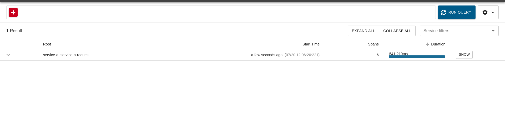
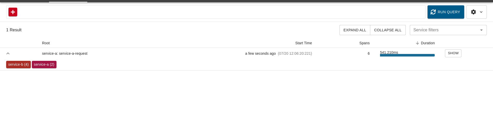
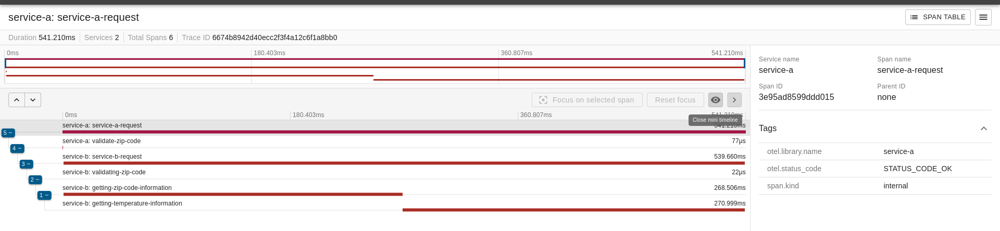

# Weather API OTEL - Golang (Eng version below)

## Descrição

Este projeto é uma API desenvolvida como parte de um exercício de pós-graduação em Golang. A API utiliza **Open Telemetry** e dois microserviços em Golang, juntamente com uma instância **Zipkin**, para gerar tracing distribuído entre os serviços. O **Serviço A** valida o CEP enviado via POST e redireciona a requisição para o **Serviço B**, que valida o CEP novamente e consulta duas fontes externas para obter informações de localização. Após validação, o **Serviço B** retorna a temperatura atual da cidade correspondente. A temperatura é convertida para **Celsius**, **Fahrenheit** e **Kelvin**.

### Requisitos do Exercício

#### Requisitos - **Serviço A** (Responsável pelo Input):
- O sistema deve receber um **CEP** válido de 8 dígitos via POST, através do seguinte schema:
  `{ "cep": "29902555" }`
- O sistema deve validar se o **CEP** é válido (8 dígitos) e se é uma **STRING**.
- Caso o **CEP** seja válido, a requisição será encaminhada para o **Serviço B** via HTTP.
- Caso o **CEP** seja inválido:
  - Código HTTP: `422`
  - Mensagem: `"invalid zipcode"`

#### Requisitos - **Serviço B** (Responsável pela Orquestração):
- O sistema deve receber um **CEP** válido de 8 dígitos.
- O sistema deve realizar a pesquisa do **CEP** e encontrar o nome da localização.
- A partir dessa localização, deve retornar a temperatura e formatá-la em **Celsius**, **Fahrenheit** e **Kelvin**, junto com o nome da cidade.
- O sistema deve responder adequadamente nos seguintes cenários:
  - **Em caso de sucesso**:
    Código HTTP: `200`
    Response Body:
    `{ "city": "São Paulo", "temp_C": 28.5, "temp_F": 83.3, "temp_K": 301.65 }`
  - **Em caso de falha (CEP inválido)**:
    Código HTTP: `422`
    Mensagem: `"invalid zipcode"`
  - **Em caso de falha (CEP não encontrado)**:
    Código HTTP: `404`
    Mensagem: `"can not find zipcode"`

Após a implementação dos serviços, o **OpenTelemetry** e **Zipkin** devem ser integrados para fornecer tracing distribuído entre os serviços.

- **Implementar tracing distribuído** entre o **Serviço A** e o **Serviço B**.
- Utilizar **spans** para medir o tempo de resposta do serviço de busca do CEP e da consulta de temperatura.

## Funcionalidades

- **Consulta a localização** a partir de um **CEP** utilizando as APIs **BrasilAPI** e **ViaCEP**.
- **Validação do formato do CEP** antes de realizar a consulta.
- **Consulta à temperatura** atual da cidade usando uma API externa de clima.
- **Conversão de temperatura** para **Celsius**, **Fahrenheit** e **Kelvin**.
- Resposta estruturada em formato **JSON** com a temperatura nas três escalas, juntamente com o nome da cidade.
- **Tratamento de erros** para respostas inválidas ou falhas de API.
- **Tracing distribuído** entre os serviços A e B, exportando dados para o **Zipkin**.

## Requisitos

- Go 1.23.3 ou superior
- Variáveis de ambiente configuradas, incluindo a chave de API para o serviço de clima.
- Acesso à internet para consumir as APIs externas de localização e clima.
- Instância do **Zipkin** em execução para visualização dos traces.

## Como Testar

### Chamar o Serviço A

Para testar o **Serviço A**, basta chamar o endpoint com um **CEP válido** via POST:

`curl -X POST http://localhost:8080 -d '{"cep": "12345678"}' -H "Content-Type: application/json"`

### Visualizar Dados no Zipkin

Você pode visualizar os traces no **Zipkin** acessando o seguinte endereço:

`http://localhost:9411`

### Visualizar Ambos os Serviços

Na interface do **Zipkin**, você pode verificar os traces de ambos os serviços sendo chamados.

### Visualizar Trace Completo

A visualização do trace completo mostra todas as etapas de spans de cada serviço, como a validação do **CEP** no **Serviço A**, a requisição para obter informações do CEP e a consulta de clima no **Serviço B**. Cada uma dessas etapas está representada com seu respectivo tempo na stack trace.

## Como Acessar a API

A API está hospedada localmente e pode ser acessada nos seguintes endpoints:

- Serviço A: `http://localhost:8080`
- Zipkin UI: `http://localhost:9411`

---

# Weather API OTEL - Golang (Versão em Português acima)

## Description

This project is an API developed as part of a postgraduate exercise in Golang. The API uses **Open Telemetry** and two microservices in Golang, along with a **Zipkin** instance, to generate distributed tracing between the services. **Service A** validates the ZIP code sent via POST and redirects the request to **Service B**, which validates the ZIP code again and queries two external sources to obtain location information. After validation, **Service B** returns the current temperature of the corresponding city. The temperature is converted into **Celsius**, **Fahrenheit**, and **Kelvin**.

### Exercise Requirements

#### Requirements - **Service A** (Responsible for Input):
- The system must receive a valid **8-digit ZIP code** via POST, using the following schema:
  `{ "cep": "29902555" }`
- The system must validate if the **ZIP code** is valid (8 digits) and if it is a **STRING**.
- If the **ZIP code** is valid, the request will be forwarded to **Service B** via HTTP.
- If the **ZIP code** is invalid:
  - HTTP Code: `422`
  - Message: `"invalid zipcode"`

#### Requirements - **Service B** (Responsible for Orchestration):
- The system must receive a valid **8-digit ZIP code**.
- The system must query the **ZIP code** and find the location name.
- From this location, it must return the temperature and format it into **Celsius**, **Fahrenheit**, and **Kelvin**, along with the city name.
- The system should respond appropriately in the following scenarios:
  - **On success**:
    HTTP Code: `200`
    Response Body:
    `{ "city": "São Paulo", "temp_C": 28.5, "temp_F": 83.3, "temp_K": 301.65 }`
  - **On failure (invalid ZIP code)**:
    HTTP Code: `422`
    Message: `"invalid zipcode"`
  - **On failure (ZIP code not found)**:
    HTTP Code: `404`
    Message: `"can not find zipcode"`

After implementing the services, **OpenTelemetry** and **Zipkin** should be integrated to provide distributed tracing between the services.

- **Implement distributed tracing** between **Service A** and **Service B**.
- Use **spans** to measure the response time for the ZIP code lookup and temperature query.

## Features

- **Location query** from a **ZIP code** using the **BrasilAPI** and **ViaCEP** APIs.
- **ZIP code format validation** before making the request.
- **Current temperature query** for the city using an external weather API.
- **Temperature conversion** to **Celsius**, **Fahrenheit**, and **Kelvin**.
- Response structured in **JSON** format with temperature in the three scales, along with the city name.
- **Error handling** for invalid responses or API failures.
- **Distributed tracing** between Service A and Service B, exporting data to **Zipkin**.

## Requirements

- Go 1.23.3 or higher
- Environment variables configured, including the API key for the weather service.
- Internet access to consume external location and weather APIs.
- A running **Zipkin** instance to visualize the traces.

## How to Test

### Calling Service A

To test **Service A**, simply call the endpoint with a **valid ZIP code** via POST:

`curl -X POST http://localhost:8080 -d '{"cep": "12345678"}' -H "Content-Type: application/json"`

### View Data in Zipkin

You can view the traces in **Zipkin** by accessing the following URL:

`http://localhost:9411`

### View Both Services

In the **Zipkin** interface, you can check the traces for both services being called.

### View Complete Trace

The complete trace visualization shows all the steps of spans for each service, such as ZIP code validation in **Service A**, the request to get ZIP code information, and the weather query in **Service B**. Each of these steps is represented with its respective time in the stack trace.

## How to Access the API

The API is hosted locally and can be accessed at the following endpoints:

- Service A: `http://localhost:8080`
- Zipkin UI: `http://localhost:9411`
